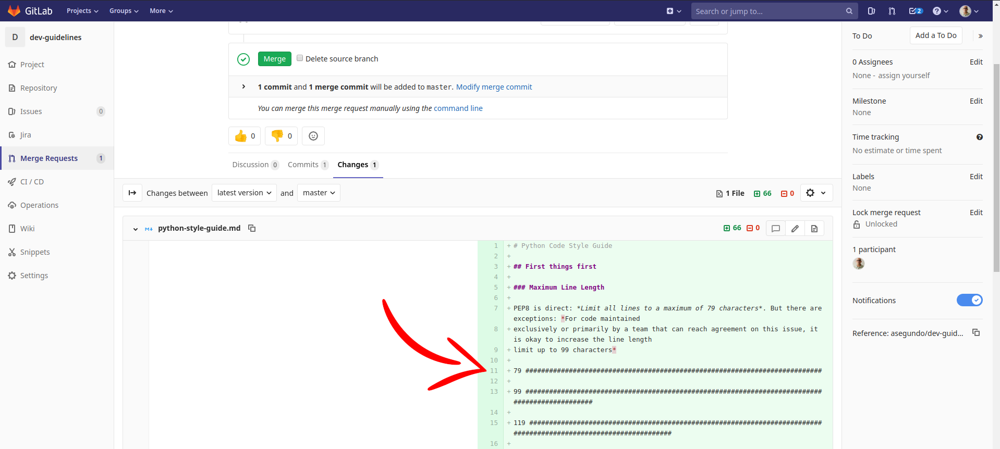

# Python Code Style Guide

This document outlines the Python Code Style practices that, when followed,
will increase readability, maintainability and safety of the code.

## Python Version

The minimum Python version for new projects is 3.6. If using a newer version
of Python, make sure the code is compatible with Python 3.6.

Here's a list of popular features that will make your code incompatible with
Python 3.6:

- [dataclasses](https://docs.python.org/3.7/library/dataclasses.html) (Python
  3.7)
- [breakpoint](https://docs.python.org/3.7/library/functions.html#breakpoint)
  (Python 3.7)
- [Assignment Expressions](https://docs.python.org/3/whatsnew/3.8.html#assignment-expressions)
  (Python 3.8)
- [Positional-only Parameters](https://docs.python.org/3/whatsnew/3.8.html#positional-only-parameters)
  (Python 3.8)
- [f-strings support for =](https://docs.python.org/3/whatsnew/3.8.html#f-strings-support-for-self-documenting-expressions-and-debugging)
  (Python 3.8)

Please refer to the [official documentation](https://docs.python.org/3/whatsnew/)
for a complete list.

## Shebang

For scripts distributed via system packages (e.g. rpm), the default shebang is
`#!/usr/bin/python`. Additionally, `#!/usr/bin/python2` and
`#!/usr/bin/python3` are also accepted. Using `#!/usr/bin/env python` is
[banned](https://lists.fedoraproject.org/archives/list/devel@lists.fedoraproject.org/message/2PD5RNJRKPN2DVTNGJSBHR5RUSVZSDZI/)
and will soon result in a package build error.

For scripts distributed directly and meant to work in a virtual environment,
using `#!/usr/bin/env python` is accepted.

## Maximum Line Length

[PEP8](https://www.python.org/dev/peps/pep-0008/#maximum-line-length) states:
*Limit all lines to a maximum of 79 characters*. But there are exceptions:
*For code maintained  exclusively or primarily by a team that can
reach agreement on this issue, it is okay to increase the line length limit ups
to 99 characters*

Taking into consideration the tools we use, the main constraint we have is
GitLab. With both side panels extended and comparing changes side by side in a
FullHD monitor, only the lines up to 79 characters are not wrapped:




So we define as the standard for our projects:

- Line Length of **79 characters**.
- Docstrings and comments limited to **72 characters**, as specified by the
  PEP8.

Exceptions:

- URLs.
- Paths.
- Imports.
- Flags in comments.

## Docstrings

We follow the [PEP257](https://www.python.org/dev/peps/pep-0257/), which
outlines:

- All modules should normally have docstrings
- All functions and classes exported by a module should also have docstrings.
- Public methods (including the `__init__` constructor) should also have
  docstrings.
- A package may be documented in the module docstring of the `__init__.py` file
  in the package directory.

We use reStructuredText ([PEP287](https://www.python.org/dev/peps/pep-0287/))
format that is used by [Sphinx](http://www.sphinx-doc.org/) to generate
documentation:

- Always use the three double-quote """ format.
- A summary line (one physical line) terminated by a period, question mark, or
  exclamation point, followed by a blank line, followed by he rest of the
  docstring starting at the same cursor position as the first quote of the
  first line.
- Parameters using `:param <name>: <description>`.
- Type of the parameters `:type <parameter>: <parameter type>`.
- Return using `:return: <description>`
- Return type using `:rtype: <return type>`

Example:

```python
"""Summary of module here."""


class MyClass:
        """
        Summary of class here.

        Longer class information...
        Longer class information...

        :param param1: this is a first value
        :param param2: this is a second value
        :type param1: int
        :type param2: int
        """
        def __init__(self, param1, param2):
            """Summary of method here."""
            self.param1 = param1
            self.param2 = param2

        def sum(self):
            """
            Summary of method here.

            Longer method information...
            Longer method information...

            :return: the sum of param1 and param2
            :rtype: int
            """
            return int(self.param1 + self.param2)
```

IDE tips:

- Use the https://github.com/NilsJPWerner/autoDocstring extension in vsCode to generate `sphinx` docstrings automatically.

## Comments

Block comments should precede tricky parts of the code, non-obvious ones get
comments at the end of the line.

Always assume that the person reading the comments knows Python (though not
what you’re trying to do) better than you do.

Good:

```python
    # At this point, the lock file is there, it belongs
    # to a running process and we are just waiting for
    # it to be released.
    if self.timeout <= 0:  # Negative timeout and no lock gives a different msg
        raise AlreadyLocked('File is already locked.')
    elif time.time() > timelimit:
        raise AlreadyLocked('Timeout waiting for the lock.')
    else:
        time.sleep(0.1)
```

Bad:

```python
    # Negative timeout will raise an exception.
    # Current time greater than time limit will also raise an
    # exception. Otherwise, we sleep a bit.
    if self.timeout <= 0:
        raise AlreadyLocked('File is already locked.')
    elif time.time() > timelimit:
        raise AlreadyLocked('Timeout waiting for the lock.')
    else:
        time.sleep(0.1)
```

## Single Quotes / Double Quotes

[PEP8](https://www.python.org/dev/peps/pep-0008/#string-quotes) says both can
be used, we just have to be consistent.

We then stick to single quotes, shifting to double quotes to avoid backslashes.

Good:

```python
print('I can!')
print("I can't")
```

Bad:

```python
print('I can!')
print('I can\'t')
```

## Imports

Do not use import statements for classes and functions (exception is when
importing from the `typing` module). That way sources are easily and
consistently identified.

Good:

```python
import requests


requests.get(...)
```

Bad:

```python
from requests import get


get(...)
```

Do not import from relative names. Always use the full package name.

Good:

```python
from mypackage import utils
```

Bad:

```python
import ..utils
```

## Naming Conventions

The [PEP8](https://www.python.org/dev/peps/pep-0008/#naming-conventions)
presents an extensive section about Naming Conventions. Here's a summary
of the conventions we follow:

- Packages: `lower_with_under`
- Modules: `lower_with_under` / `_lower_with_under`
- Classes: `CapWords` / `_CapWords`
- Exceptions: `CapWords`
- Functions: `lower_with_under()` / `_lower_with_under()`
- Constants: `CAPS_WITH_UNDER` / `_CAPS_WITH_UNDER`
- Variables: `lower_with_under` / `_lower_with_under`
- Methods: `lower_with_under()` / `_lower_with_under()`
- Function/Method Parameters: `lower_with_under`

**NOTE:** The versions with leading underscore are either internal to the modules,
protected or private within a class.

## Default Value for Attributes

Setting the attribute defaults to a mutable object is unsafe, since changes in
that object will affect all the instances created from it.

Unsafe:

 ```python
class MyClass:
    def __init__(self, data=[]):
        self.data = data
```

Safe:

 ```python
class MyClass:
    def __init__(self, data=None):
        if data is None:
            self.data = []
        else:
            self.data = data
```

The initialization should specifically check for `None`, otherwise an empty
string, an integer with value `0`, any empty data structure or any custom
object which `bool()` evaluates to `False` will be replaced by a list.

Also good:

```python
class MyClass:
    def __init__(self, data=None):
        self.data = data if data is not None else []
```

Bad:

```python
class MyClass:
    def __init__(self, data=None):
        if data:
            self.data = data
        else:
            self.data = []
```

Also bad:

```python
class MyClass:
    def __init__(self, data=None):
        self.data = data or []
```

## Attribute Resolution and `__getattr__`

Relying on `__getattr__` to resolve your attributes might give you flexibility,
but it also degradates the performance. Because of that, `__getattr__` should
only be used as a fallback attribute resolution resource, not as the main
entry-point for them.

For example, if you know as a fact that attributes `a` and `b` will exist,
then this is good:

```python
class MyClass:
    def __init__(self):
        self.a = 'I am "a"'
        self.b = 'I am "b"'

    def __getattr__(self, item):
        return f'I am {item}'
```

And this is bad:

```python
class MyClass:
     def __getattr__(self, item):
        return f'I am {item}'
```

## Nested Conditions

Avoiding nested conditions by using `continue`, `break` or `return` will make
the code more readable.

Good:

```python
for item in [1, 2, 3, 4, 5, 6]:
    if item % 2:
        continue
    if item <= 4:
        continue
    print(f'found an even item greater than 4: {item}')
```

Bad:

```python
for item in [1, 2, 3, 4, 5, 6]:
    if not item % 2:
        if item > 4:
            print(f'found an even item greater than 4: {item}')
```

## Namedtuples

Namedtuples (`collections.nametuple()`) are fast and lightweight. They are also
handy for many situations. Nonetheless, they are - and behave like - tuples.

The attention point is that the object types and their attribute names are not
taken into account when checking the object equality, only the values are.

Example:

```python
from collections import namedtuple

NCar = namedtuple('Car', ['color', 'number_of_wheels'])
NTea = namedtuple('Tea', ['type', 'max_per_day'])
```

Using and comparing them:

```
>>> car = NCar(color='green', number_of_wheels=4)
>>> tea = NTea(type='green', max_per_day=4)
>>>
>>> type(car)
<class '__main__.Car'>
>>>
>>> type(tea)
<class '__main__.Tea'>
>>>
>>> print(car == tea)
True
```

As **expected**, two tuples with the same values are equal. If that behaviour
is not what you'd expect, you should use dictionaries or create your own custom
classes.

## Shared State

A common approach for keeping the state over multiple instances of a given
object is by using the singleton pattern. Example:

```python
class MyClass:
    def __init__(self):
        pass


class MySingleton:

    _instance = None

    @classmethod
    def __new__(cls, *args, **kwargs):
        if cls._instance is None:
            cls._instance = MyClass()
        return cls._instance
```

Checking the shared state:

```
>>> instance1 = MySingleton()
>>> instance2 = MySingleton()
>>> instance1.arg1 = 10
>>> print(instance2.arg1)
10
```

The problem with the singleton pattern is that it gives you the same object all
the time, so you don't really have multiple instances:

```
>>> id(instance1)
140125550838992
>>> id(instance2)
140125550838992
```

A better alternative is the **Borg** pattern, which aims to share the state
among instances, while actually giving you different instances:

```python
class MyBorg:

    _state = {}

    def __init__(self):
        self.__dict__ = self._state


class MyClass(MyBorg):
    pass
```

Checking the shared state:

```
>>> instance1 = MyClass()
>>> instance2 = MyClass()
>>> instance1.arg1 = 10
>>> print(instance2.arg1)
10
```

And checking the IDs:

```
>>> id(instance1)
140125548133776
>>> id(instance2)
140125538275856
```

## Command Line Interface

If the project includes a CLI, a single command should give access to all the
functionalities. Multiple commands created out of the same package are
harder to maintain and can easily diverge in terms of usability and interface.

Good:

```bash
$ mycli --help
usage: mycli [-h] {list,run}

My CLI

subcommands:
    list                List foobar
    run                 Runs foobar

$ mycli list --help
usage: mycli list [-h] [foobar]

$ mycli run --help
usage: mycli run [-h] [foobar]
```

Bad:

```bash
$ mycli-list --help
usage: mycli-list [-h] [foobar]

$ mycli-run --help
usage: mycli-run [-h] [foobar]
```

## Project Dependencies

`requirements.txt` and `setup.py` are different animals. The former is meant
for fixed development dependencies. The later is meant for package
distribution. With `requirements.txt`, you pin point the dependencies in their
exact versions so another developer will have the same environment. The
`setup.py` is used to define the minimum dependencies and their minimum
versions, so the package, when distributed, will have the software it needs to
work in place.

It is expected that some packages will be present in both `requirements.txt`
and `setup.py`, but the version specification and the purpose of their presence
are both different.

### Development Dependencies

In order to set up the development environment, all the projects contain a
`requirements.txt` file, listing all the direct development dependencies in
exact versions.

Good:

```
pytest==5.3.1
pylint==2.4.4
requests==2.22.0
```

Bad:

```
pytest
pylint>=2.4.4
requests
```

Additional requirements files are accepted for other development activities.
For example, a project might have a `requirements-ci.txt` the dependencies
that are specific for the CI pipeline execution. Anyway, chances are that most
of the projects will be well served with a single `requirements.txt` and no
projects will go beyond the second requirements file.

### Distribution Dependencies

To package your project, a `setup.py` should be in place. There, you should
specify the **minimum dependencies** and the **minimum version** of them.
Additionally, you can pin the dependencies versions to the MINOR (considering
MAJOR.MINOR.PATCH), but avoid fixed versions.

Good:

```
    ...
    install_requires=[
        "requests>=2.22.0"
    ],
```

Also good:

```
    ...
    install_requires=[
        "requests~=2.22"
    ],
```

Bad:

```
    ...
    install_requires=[
        "requests==2.22.0"
    ],
```


Also bad:

```
    ...
    install_requires=[
        "requests"
    ],
```

## Flask

[Flask](https://flask.palletsprojects.com/) is a lightweight WSGI web
application framework.

## Project Structure

The most common use case is a project with one application only. Although less
common, some projects might maintain multiple Flask applications in their
repository.

Regardless the single/multi application(s) aspect, the recommendation is to
have a functional project structure, in which the following directories might
be present:

* `controllers`: where the routes are defined. `controllers` will use
  `services` to implement the routes functionalities.
* `models`: where the database models are defined. `models` are used by the
  `services` to implement the functionalities.
* `services`: abstractions implementing the core functionalities. `services`
  are used by `controllers`. `services` consume `models`.
* `schema`: the place for the swagger file.
* `templates`: where the html views are placed.

### Single Application

A typical frontend project would have:

```
.
├── <package>
│   ├── __init__.py
│   ├── controllers
│   │   ├── __init__.py
│   │   └── <controller>.py
│   ├── services
│   │   ├── __init__.py
│   │   └── <service>.py
│   └── templates
│       └── <template>.html
└── setup.py
```

A typical backend/API project would have:

```
.
├── <package>
│   ├── __init__.py
│   ├── controllers
│   │   ├── __init__.py
│   │   └── <controller>.py
│   ├── models
│   │   └── <model>.py
│   ├── schema
│   │   └── swagger.yaml
│   └── services
│       ├── __init__.py
│       └── <service>.py
└── setup.py
```

### Multiple Applications

On top of the functional structure, create one directory per application.

```
.
├── <frontend>
│   ├── <package>
│   │   ├── __init__.py
│   │   ├── controllers
│   │   │   ├── __init__.py
│   │   │   └── <controller>.py
│   │   ├── models
│   │   │   └── <model>.py
│   │   ├── schema
│   │   │   └── swagger.yaml
│   │   └── services
│   │       ├── __init__.py
│   │       └── <service>.py
│   └── setup.py
└── <backend>
    ├── <package>
    │   ├── __init__.py
    │   ├── controllers
    │   │   ├── __init__.py
    │   │   └── <controller>.py
    │   ├── models
    │   │   └── <model>.py
    │   ├── schema
    │   │   └── swagger.yaml
    │   └── services
    │       ├── __init__.py
    │       └── <service>.py
    └── setup.py

```

## Routes Resolver

When creating the controllers, instead of manually defining the routes, resolve
them from the `swagger.yaml`. To do so, one option is to use the
`RestyResolver` from the `connexion` module:

```
import connexion

app = connexion.App(__name__, specification_dir='schema/')
app.add_api('swagger.yaml')
app.run(port=8080)
```

That will require a file in the `controllers` directory with the name matching
the api path, e.g. `metrics.py`, and functions in that file with the name
matching the HTTP methods, e.g. `def post()`.

Notice that the route functions won't need the `app.route` decorators then.

## Running the Application

Flask’s built-in server is not suitable for production as it doesn’t scale
well.

We recommend using [Gunicorn](https://gunicorn.org/). Just add to your
`Dockerfile` (customizing accordingly):

```
...

RUN         pip install gunicorn

...

ENTRYPOINT  ["gunicorn", "<package>:app.app"]
CMD         ["--workers", "2", "--threads",  "2", "--bind", "0.0.0.0:8080"]
```
